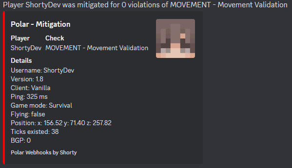

# Polar Webhooks

This is a simple webhook plugin for [Polar Anticheat](https://polar.top). It allows you to send notifications to a Discord channel when a player is mitigated, detected or punished.

If you have any suggestions, feel free to open an issue or a pull request.

### Mitigation message example (default config)
This is an example of the default config for the mitigation message. The details field has been filtered using the `filter_detail_lines` field.



## Download

[Github Releases](https://github.com/ShortyDev/PolarWebhooks/releases)

## How to create a webhook

1. Navigate to your Discord server
2. Open the settings of the channel you want to send the notifications to
3. Click on `Integrations`
4. Click on `Create Webhook` or `View Webhooks` and then `New Webhook` if you already have other webhooks
5. Enter a name for the webhook and optionally change the avatar
6. Copy the webhook URL and paste it into the config

### Rate Limit (IMPORTANT)

Discord has a rate limit on webhooks, which means that a lot of messages on the same webhook most likely won't be sent.
This is why it is recommended to create a new webhook for each type of message (mitigation, detection, ...). You can
also optionally set the `cooldown_per_player_and_type` field to a higher value to prevent the plugin from sending too
many messages. For mitigations, the default value of this field is `5` seconds.

#### Global rate limit

The global rate limit is 50 messages per second. This means you can't exceed 50 messages per second from a single IP
address.

## Config

### Cooldown per player and type
The cooldown per player and type field allows you to set a cooldown for each player and check type. This is useful for preventing a player from spamming the webhook. For example, if you set the cooldown to 5 seconds, the plugin will not send any notifications of that type for that player until 5 seconds have passed. A cooldown of 0 means that there is no cooldown.

### Notifications field
The notification list should contain all types of checks that you want to receive alerts for. By default, all checks are enabled. If you want to disable a check, simply remove it from the list.

### Filter detail lines field
The detail line filter allows you to filter out certain detail lines from being sent to Discord. This is useful for removing debug lines or lines that are not useful to you. If an asterisk is added to the end of a line, it will filter out all lines that start with that string. For example, adding `Debug*` to the filter list will filter out all lines that start with `Debug`. The same goes for adding `Click to teleport` to the filter list, it will filter out all lines that contain `Click to teleport`. You can also place an asterisk at the start and end of a line in order to check if a line contains a certain string. For example, adding `*name*` to the filter list will filter out all lines that contain `name`.

```yml
# Placeholders
# Global: %PLAYER_NAME%, %PLAYER_UUID%, %PLAYER_PROTOCOL_VERSION%, %PLAYER_LATENCY%, %PLAYER_IP%, %PLAYER_CLIENT_VERSION_NAME%, %PLAYER_CLIENT_BRAND%, %TIMESTAMP% (current time in RFC-3339 format), %TIMESTAMP_UNIX% (current time in Unix format)
# Mitigation: %VL%, %PUNISH_VL%, %CHECK_TYPE%, %CHECK_NAME%, %DETAILS%
# Detection: %VL%, %PUNISH_VL%, %CHECK_TYPE%, %CHECK_NAME%, %DETAILS%
# Cloud Detection: %CHECK_TYPE%, %DETAILS%
# Punishment: %PUNISHMENT%, %REASON%
mitigation:
  webhook_url: "https://discord.com/api/webhooks/1234567890/abcdefghijklmnopqrstuvwxyz"
  enabled: true
  round_vl: true # Rounds the VL to the nearest integer
  cooldown_per_player_and_type: 5 # Seconds
  notifications:
    - 'MOVEMENT'
    - 'VELOCITY'
    - 'GROUND_SPOOF'
    - 'LATENCY_ABUSE'
    - 'TICK_SPEED'
    - 'REACH'
    - 'BLOCK_INTERACT'
    - 'PHASE'
    - 'CLOUD'
  filter_detail_lines: # Allows you to filter out certain detail lines from being sent to Discord
    - 'Click to teleport'
    - 'Debug*' # Lines starting with "Debug" will be filtered out
  content: 'Player %PLAYER_NAME% was mitigated for %VL% violations of %CHECK_TYPE% - %CHECK_NAME%'
  embed:
    title: 'Polar - Mitigation'
    description: ''
    color: 'ff0000' # Hex color code
    footer:
      text: 'Polar Webhooks by Shorty'
      icon_url: ''
    thumbnail:
      url: 'https://mc-heads.net/avatar/%PLAYER_NAME%'
    image:
      url: ''
    timestamp: '%TIMESTAMP%'
    fields:
      0:
        name: 'Player'
        value: '%PLAYER_NAME%'
        inline: true
      1:
        name: 'Check'
        value: '%CHECK_TYPE% - %CHECK_NAME%'
        inline: true
      2:
        name: 'Details'
        value: '%DETAILS%'
        inline: false
detection:
  webhook_url: "https://discord.com/api/webhooks/1234567890/abcdefghijklmnopqrstuvwxyz"
  enabled: true
  round_vl: true # Rounds the VL to the nearest integer
  cooldown_per_player_and_type: 0 # Seconds
  notifications:
    - 'MOVEMENT'
    - 'VELOCITY'
    - 'GROUND_SPOOF'
    - 'LATENCY_ABUSE'
    - 'TICK_SPEED'
    - 'REACH'
    - 'BLOCK_INTERACT'
    - 'PHASE'
    - 'CLOUD'
  filter_detail_lines: # Allows you to filter out certain detail lines from being sent to Discord
    - 'Click to teleport'
    - 'Debug*' # Lines starting with "Debug" will be filtered out
  content: 'Player %PLAYER_NAME% detected for %CHECK_TYPE% - %CHECK_NAME%'
  embed:
    title: 'Polar - Detection'
    description: 'Player %PLAYER_NAME% detected for %CHECK_TYPE% - %CHECK_NAME%'
    color: 'ff0000' # Hex color code
    footer:
      text: 'Polar Webhooks by Shorty'
      icon_url: ''
    thumbnail:
      url: 'https://mc-heads.net/avatar/%PLAYER_NAME%'
    image:
      url: ''
    timestamp: '%TIMESTAMP%'
    fields:
      0:
        name: 'Player'
        value: '%PLAYER_NAME%'
        inline: true
      1:
        name: 'Check'
        value: '%CHECK_TYPE% - %CHECK_NAME%'
        inline: true
      2:
        name: 'Details'
        value: '%DETAILS%'
        inline: false
cloud_detection: # Please note that %VL% and %CHECK_NAME% are not available for cloud detections
  webhook_url: "https://discord.com/api/webhooks/1234567890/abcdefghijklmnopqrstuvwxyz"
  enabled: true
  cooldown_per_player_and_type: 0 # Seconds
  notifications:
    - 'AUTO_CLICKER'
    - 'CHEST_STEALER'
    - 'COMBAT_BEHAVIOR'
    - 'INVALID_PROTOCOL'
    - 'SCAFFOLD'
    - 'CPS_LIMIT'
    - 'RIGHT_CPS_LIMIT'
  filter_detail_lines: # Allows you to filter out certain detail lines from being sent to Discord
    - 'Click to teleport'
    - 'Debug*' # Lines starting with "Debug" will be filtered out
  content: '[Cloud] Player %PLAYER_NAME% detected for %CHECK_TYPE%'
  embed:
    title: 'Polar - Detection'
    description: 'Player %PLAYER_NAME% detected for %CHECK_TYPE%'
    color: 'ff0000' # Hex color code
    footer:
      text: 'Polar Webhooks by Shorty'
      icon_url: ''
    thumbnail:
      url: 'https://mc-heads.net/avatar/%PLAYER_NAME%'
    image:
      url: ''
    timestamp: '%TIMESTAMP%'
    fields:
      0:
        name: 'Player'
        value: '%PLAYER_NAME%'
        inline: true
      1:
        name: 'Check'
        value: '%CHECK_TYPE%'
        inline: true
      2:
        name: 'Details'
        value: '%DETAILS%'
        inline: false
punishment: # Please note that no other placeholders except for %PLAYER_NAME%, %PUNISHMENT% and %REASON% are available for punishments
  webhook_url: "https://discord.com/api/webhooks/1234567890/abcdefghijklmnopqrstuvwxyz"
  enabled: true
  types_enabled: # Remove from list to disable notifications for that punishment type
    - 'BAN'
    - 'KICK'
  cooldown_per_player: 0 # Seconds
  content: 'Player %PLAYER_NAME% was punished for %REASON% (%PUNISHMENT%)'
  embed:
    title: 'Polar - Punishment'
    description: ''
    color: 'ff0000' # Hex color code
    footer:
      text: 'Polar Webhooks by Shorty'
      icon_url: ''
    thumbnail:
      url: 'https://mc-heads.net/avatar/%PLAYER_NAME%'
    image:
      url: ''
    timestamp: '%TIMESTAMP%'
    fields:
      0:
        name: 'Player'
        value: '%PLAYER_NAME%'
        inline: true
```